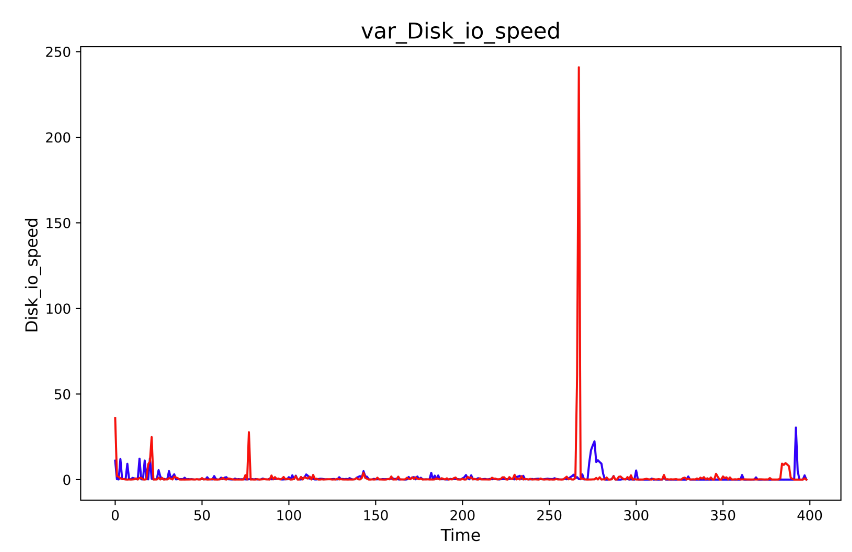
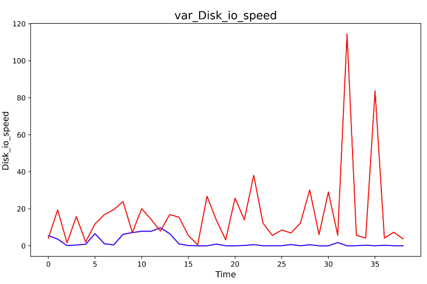

## Project Report 

#### ——Comparing OpenGauss and Postgresql based on a simulation of a library database

#### p.s. *Questions in the project description sheet are answered again at the last part*

### 1. Experiment Settings

#### 1.1 Introduction

In this experiment, two databases will be tested. The two most important indicators determining database quality are **security** and **performance**. For performance, the key metrics include **CPU usage**, **memory usage**, **disk read/write speed**, and **transaction execution speed**. This experiment will compare the two databases based on these four performance metrics.

The experiment follows a process where SQL files are written using Python, and the databases execute the SQL commands on the same ECS while Python monitors the system's status. Finally, the collected data is processed in Python to generate charts.

To better simulate real-world scenarios, this experiment uses a database designed to replicate a library's operational workflow.

#### 1.2 Database Design

This experiment uses 8 interconnected tables to simulate the work flow of a library system.

The 8 tables store the following information:

- Stock information
- Reader information
- Pending borrowing information
- Successful borrowing information
- Return information
- Reader collection information
- Procurement list
- Book information

##### **1. Inventory Information**

- `id`: Book ID, unique, starting from 1.
- `book_name`: Book name, unique, **selected from the book name set**.
- `book_num`: Quantity of the book, **randomly generated between 1 and 100 initially**.
- `price`: Book price, **randomly generated between 20 and 40 initially**.

##### **2. Reader Information**

- `id`: Reader ID, unique, sorted starting from 1.
- `reader_name`: Reader name, not unique, **selected from the name set**.
- `address`: Reader address, not unique, **randomly generated string with a length between 10 and 30 characters**.
- `deposit`: Deposit amount, not unique, **randomly generated integer between 50 and 200**.
- `cost`: Deposit used for borrowing, **initially set to 0**.

##### **3. Pending Borrowing Information**

- `id`: List ID, unique, sorted starting from 1.
- `reader_id`: ID of the reader intending to borrow books.
- `book_id`: ID of the book intended to be borrowed.
- `borrow_num`: Number of copies of the book intended to be borrowed.
- `dealt`: Whether the request has been processed.

##### **4. Successful Borrowing Information**

- `id`: Borrowing ID, unique, corresponds to the pending borrowing ID.
- `reader_id`: ID of the reader who borrowed books.
- `book_id`: ID of the book borrowed.
- `borrow_num`: Number of copies of the book borrowed.

##### **5. Return Information**

- `id`: Return ID, unique, sorted starting from 1.
- `reader_id`: ID of the reader returning books.
- `dealt`: Whether the return request has been processed.

##### **6. Reader Collection Information**

- `id`: Reader ID, unique.
- `book_id`: Book ID.
- `(id, book_id)`: Unique combination of reader ID and book ID.
- `book_num`: Number of copies of the book owned by the reader.

##### **7. Procurement List**

- `id`: List ID, not unique.
- `book_id`: Book ID.
- `book_num`: Number of copies of the book to be procured.
- `dealt`: Whether the procurement request has been processed.

##### **8. Book Information**

- `id`: Book ID.
- `name`: Book name.

##### **Work flow**

Assume this is a database system for managing a library.

1. **Generate Name and Book Sets**:
   - **Name Set**: Randomly generate strings of length **3-8** as the surname set and given name set, then combine them with a hyphen (`-`) to form full names.
   - **Book Name Set**: Randomly generate unique strings of length **3-30** consisting of letters and numbers.
2. **Initialize the Database**:
   - Generate a random initial inventory and user database based on the size of the dataset for the current experiment.
3. **Regular work flow**:
   - Borrowing:
     - A **random resident** selects **1-5 books** to add to the pending borrowing list.
     - Check if the library has enough copies of the requested books and if the resident has sufficient remaining deposit.
     - If both conditions are met, generate borrowing information and update the reader’s collection, reader information, and inventory information. If not, reject the request (mark it as processed without any other effect).
   - Returning:
     - A **random resident** is returns all their borrowed books. Generate return information and update the reader’s information, reader collection, and inventory information.
   - Procurement:
     - Generate a random procurement list and update the inventory information.
4. **Adjust Parameters**:
   - The frequency of these operations and related parameters will be adjusted for different experiments.
   - Instruction proportions: **Pending Borrowing : Returning: Procurement  = 8:1:1**. The number of instructions is input into the `SQL_generator`.

When handling transaction requests, a dedicated processing function is written for each type of transaction. The process involves inserting a request record and then invoking the corresponding processing function.

#### 1.3 Experiment Data

This experiment consists of two parts:

1. **Testing the performance of inserting data **: The dataset includes 25,000 randomly generated residents and 50,000 books. The experiment will be repeated 9 times for each database, and both the variance and the average will be recorded.
2. **Testing the performance of transaction processing**: The dataset includes a total of 2,000 randomly generated transaction requests (borrowing/returning/purchasing). The experiment will be repeated 9 times for each database, and both the variance and the average will be recorded.

### 2. Experiment Results

#### 2.1 Data & Charts

**( In the charts: Red is for Opengauss ,Blue is for Postgresql)**

##### 2.1.1 Data Insertion

* Total time ( 75,000 Insertions )

  |          | Postgresql | OpenGauss |
  | -------- | ---------- | --------- |
  | Average  | 288.2s     | 383.2s    |
  | Variance | 16.7       | 34.4      |

* CPU usage 

  * Average 

    

  * Variance

    

* Memory usage

  * Average

    

  * Variance

    

* Disk read/write speed

  * Average

    

  * Variance

    

##### 2.1.2 Transaction processing

* Total time ( 2000 transactions )

  |          | Postgresql | OpenGauss |
  | -------- | ---------- | --------- |
  | Average  | 11.3s      | 30.4s     |
  | Variance | 5.22       | 173.2     |

* CPU usage

  * Average

    

  * Variance

    

* Memory usage

  * Average

    

  * Variance

    

* Disk read/write speed

  * Average

    

  * Variance

    

#### 2.2 Data Explanation

##### 2.2.1 Insertion

In terms of data insertion performance, OpenGauss lags significantly behind PostgreSQL across the board.

From the perspective of average time consumption, with the same dataset size, OpenGauss takes nearly one-third more time than PostgreSQL on average. The variance of PostgreSQL is less than half that of OpenGauss, giving PostgreSQL a clear advantage in stability as well.

For CPU usage, it can be observed that OpenGauss uses slightly more CPU than PostgreSQL during runtime, with both having a similar variance.

In terms of memory usage, OpenGauss consumes significantly more memory compared to PostgreSQL. Although OpenGauss has a smaller variance in this metric, its lack of stability cannot offset its substantial performance disadvantage.

Regarding disk read/write speed, OpenGauss is noticeably slower than PostgreSQL, with both exhibiting a similar variance.

Overall, OpenGauss consumes more CPU and memory resources compared to PostgreSQL, yet its disk read/write speed and runtime efficiency are significantly lower. Therefore, in this aspect, OpenGauss is comprehensively outperformed by PostgreSQL.

##### 2.2.2 Transaction Processing

In the transaction processing test, OpenGauss also performs significantly worse than PostgreSQL.

The most noticeable difference lies in processing efficiency. For the same set of 2,000 transactions (identical for both databases in each run), PostgreSQL’s average processing time is much lower than that of OpenGauss.

In terms of CPU and memory usage, the memory consumption during transaction processing is almost identical for both databases, while OpenGauss shows slightly higher CPU usage compared to PostgreSQL. Both databases exhibit instability during transaction processing compared to data entry, which could be related to the varying complexity of individual transactions.

Regarding disk read and write speeds, both databases perform similarly during transaction processing.

In summary, OpenGauss consumes more CPU resources and has comparable disk read/write speeds to PostgreSQL. However, given these conditions, OpenGauss’s transaction processing efficiency is far inferior to PostgreSQL, indicating a significant gap in their transaction processing performance.

This may be caused by OpenGauss's weaker query optimization performance compared to PostgreSQL.

### 3 Questions Answered

* Q1 : What criteria should be used to evaluate the quality of a database? Identify and list the key metrics.
* A1 : The evaluation criteria for database quality can be categorized into two main aspects: performance and security. This experiment primarily focuses on performance metrics, including CPU usage, memory usage, disk read/write speed, data entry speed, and transaction processing speed.
* Q2 : Compare openGauss with PostgreSQL based on the metrics youʼve listed. The comparisons should be well-designed, comprehensive, and persuasive, backed by relevant experiments.
* A2 : The comparisons are listed above.
* Q3 : Provide a detailed evaluation of openGauss, including its strengths and weaknesses, supported by your findings.
* A3 : Based on the experimental results so far, the potential drawbacks of OpenGauss include: low data insertion efficiency, high CPU and memory usage, slow disk read/write speed during data insertion, low transaction processing efficiency, and poor query optimization capabilities. No significant advantages have been identified yet, although its relatively stable CPU performance during data entry might barely count as a positive aspect.
* Q4 : The report and the related source code should be released online. Publish your project report and source code online. Use GitHub or any other preferred platform for hosting. Remember to include the URL in your submission.
* A4 : The github page of this project is : https://github.com/Q1ufeng/OpenGebhard.git ,all code used to generate dataset ,convert it into .sql file or convert experiment data into charts can be found there.